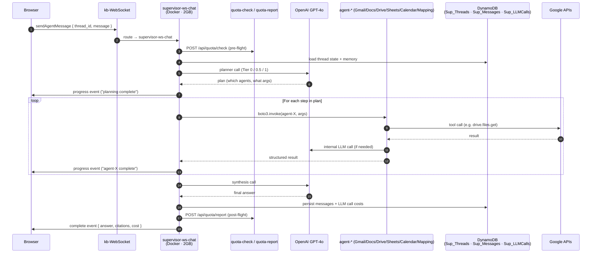

<!-- markdownlint-disable MD033 MD041 -->

<div align="center">

# Safexpress AI Operations Platform

**A chat-first, multi-agent AI operations platform for Philippines logistic company — 109 AWS Lambdas, 3 API Gateways, a 16-table DynamoDB backbone, and a React 19 single-page app.**


**Capstone project — handed over May 2026**
Built and led by **Josh Denziel Joves** · Role: full-stack + AWS infrastructure lead + Project Manager · Duration: Oct 2025 → May 2026

</div>

---

## Watch the demo

> The deployed environment was returned to the client at handover. A full walkthrough has been recorded in its place.

[](https://YOUR-VIDEO-URL-HERE)

<!-- DEMO LINK: replace https://YOUR-VIDEO-URL-HERE with the unlisted YouTube / Loom / Drive link once the recording (see DEMO_SCRIPT.md) is uploaded. -->

**What you'll see in the 4-minute walkthrough**

- A user typing a single instruction — *"Pull last week's workload PDF, summarize the anomalies, draft an email to the team"* — and watching a supervisor agent plan and execute it across Google Drive, Gmail, and a PDF parser.
- A non-technical user uploading a messy spreadsheet and getting it auto-mapped to Safexpress's canonical column schema.
- A tour of the AWS console showing the 109-Lambda fleet behind the surface.

---

## What it does

The core business outcome is **automating OPR, ABC, and Workload analytics generation** from multi-file operational inputs. Instead of manually combining different source sheets, users upload one or more input files (`.xlsx`, PDFs, and related datasets), and the system routes them through parsing, normalization, and report-generation flows to produce analytics outputs faster and with less manual prep.

On top of those static report pipelines, the platform adds a **Dynamic Mapping** layer that accepts different spreadsheet templates and auto-fills canonical target formats from one or multiple uploaded files. In parallel, it provides a KB RAG chat (`SFX Bot`), a multi-workspace AI Assistant (Gmail/Drive/Sheets/Docs/Calendar), and admin quota governance (allocation, consumption tracking, usage breakdown, and budget-threshold alert emails).

The platform delivers nine distinct surfaces, each role-gated:

| Surface | Audience | What it does |
| --- | --- | --- |
| **AI Assistant** | Admin, Manager | Chat with a supervisor agent that plans across 6 Google-API sub-agents (Gmail, Docs, Sheets, Drive, Calendar, Mapping). Supports human-in-the-loop approvals, progress streaming, file uploads, small talk, follow-up answers, prompt modifications, unintelligible-input handling, and guardrailed execution. |
| **SFX Bot** | All roles | RAG over the internal knowledge base. Users upload files they want queried, and the bot refines follow-up user input into standalone queries before retrieval, then returns citation-grounded answers from those uploaded docs. |
| **Dynamic Mapping** | All roles | Accept one or multiple Excel/CSV files, map source columns to Safexpress's canonical schema, auto-fill target templates, detect duplicate rows before write, and support human/manual duplicate resolution through preview-and-approval flow. |
| **Workload Calculator** | All roles | Generate workload analytics from uploaded operational inputs, including PDF parsing into structured rows used by the workload pipeline. |
| **Analysis Report** | All roles | Auto-generate ABC analysis and OPR (One Page Report) outputs from uploaded source files. |
| **Manage KB** | Admin | Upload, version, and delete documents in the Weaviate-backed knowledge base. |
| **KB Analytics** | Admin | Per-document query stats, chat-grounding rate, RAG error breakdowns. |
| **Token Management** | Admin | Per-user / per-model quotas, allocation and consumption tracking, usage breakdowns, dynamic monthly budgets, and budget-threshold email alerts to admins. |
| **Accounts + Logs Dashboard** | Admin | User onboarding, role assignment, deactivation; request-level observability with token cost per request. |

Role enforcement is dual-layer: the React sidebar in [`Frontend/src/components/Sidebar.jsx`](Frontend/src/components/Sidebar.jsx) hides what each role can't reach, and the same ACL is re-checked server-side in the JWT authorizer Lambda for every API call — so the UI hint can never be bypassed.

<!-- SCREENSHOT: Sidebar collapsed showing all 9 nav items for an admin user, with the QuotaWidget visible at the top -->

---

## Feature tour

<!-- SCREENSHOT: AI Assistant — chat thread mid-execution showing the progress stream ("Calling agent-drive...", "Calling agent-gmail...") and the approval modal -->

**AI Assistant** — A WebSocket-backed chat where each message kicks off a planner that decides which sub-agents to invoke. The browser receives `progress`, `paused` (waiting for approval), and `complete` events in real time via the API Gateway management API.

<!-- SCREENSHOT: SFX Bot — answer card with three citation chips at the bottom linking back to source PDF pages -->

**SFX Bot** — A lighter chat surface for RAG-only questions. Every answer cites the exact KB document and page that grounded it; ungrounded responses are explicitly flagged.

<!-- SCREENSHOT: Dynamic Mapping — split view with the user's uploaded spreadsheet columns on the left and the LLM-suggested canonical mapping on the right, with confidence scores -->

**Dynamic Mapping** — Auto-maps arbitrary spreadsheet columns to Safexpress's canonical schema using an LLM + a confidence scorer. Templates can be saved and re-applied so the second upload of a recurring file is one click.

<!-- SCREENSHOT: Workload Calculator — date range picker, hub selector, and a results table with per-shift workload breakdown -->

**Workload + PDF Parser** — Calculates per-hub workload over a date range and parses uploaded ops PDFs into structured rows.

<!-- SCREENSHOT: Analysis Report — ABC chart on the left, OPR table on the right -->

**Analysis Report** — ABC classification and OPR dashboards rendered over uploaded operational data.

<!-- SCREENSHOT: Manage KB — document list with version badges and a "new upload" drawer -->

<!-- SCREENSHOT: KB Analytics — per-document query count, grounding rate, and error breakdown -->

**Manage KB + KB Analytics** — Document lifecycle (upload, version, delete) plus a per-document analytics dashboard.

<!-- SCREENSHOT: Token Management — usage chart for the current user with a model-by-model breakdown -->

**Token Management** — Quota widget visible everywhere (compact in the sidebar, full dashboard on demand). Admins can reset, deactivate, restore, or hand-edit any user's budget.

<!-- SCREENSHOT: Logs Dashboard — request list with token cost, latency, and request_id deep-link -->

**Logs Dashboard** — Every request is logged with token cost, latency, and a request-id trail that links to the per-Lambda CloudWatch streams.

---

## Tech stack at a glance

| Layer | What we picked | Why |
| --- | --- | --- |
| **Frontend** | React 19 · Vite 7 · TailwindCSS 4 · react-router-dom 7 · @assistant-ui/react · zustand · @tiptap | Modern SPA with a chat-first surface; @assistant-ui handles streaming chat UI primitives so we focus on flows, not plumbing. |
| **Auth** | Google OAuth (@react-oauth/google) · custom JWT (HS256) · per-route role ACL | SSO via the user's existing Google Workspace identity; server-enforced role checks in a Lambda authorizer. |
| **Backend** | AWS Lambda (Python 3.11 · 3.12 · 3.13, Node.js 24) · API Gateway (REST + HTTP + WebSocket) | Serverless top-to-bottom — zero EC2, zero idle cost. Three gateways isolate auth/chat/workload concerns. |
| **AI / LLM** | OpenAI GPT-4o · LangChain 0.3 · LangGraph 0.6 · tiktoken · custom Tier-0 / 0.5 / 1 planner | LangGraph for deterministic multi-agent orchestration; tiktoken for exact pre-flight token accounting. |
| **Data** | DynamoDB (16 tables) · S3 (`capstone-kb-files`) · Weaviate (vector DB) | DynamoDB for thread/message/audit/quota state; Weaviate for RAG over uploaded SOPs and manuals. |
| **DevOps** | Docker (for heavy Lambda images) · PowerShell build scripts · AWS CLI v2 · AWS Secrets Manager | Per-Lambda build pipeline that ships a 30-50 MB ZIP for light functions and a Docker image for the 5 heavy brains. |

---

*Engineering deep-dive below.*

---

## System architecture

```mermaid
flowchart TB
    Browser["React 19 SPA<br/>(CloudFront + S3)"]

    subgraph gateways [API Gateway layer]
        AuthAPI["AuthAPI<br/>REST · 80 routes<br/>id: anf38iju12"]
        WSAPI["kb-WebSocket<br/>5 routes<br/>id: rjhzxw8sqj"]
        WorkloadAPI["safexpressops-workload-api<br/>HTTP · 12 routes<br/>id: jwf4gfdzyd"]
        OtherAPIs["5 other HTTP APIs<br/>(abc · opr · sheets · mapping · image)"]
    end

    subgraph authz [Authorizers]
        PyAuth["jwt-api-authorizer<br/>Python 3.11<br/>TOKEN + REQUEST"]
        NodeAuth["safexpressops-jwt-authorizer<br/>Node.js 24"]
    end

    subgraph lambdas [Lambda fleet · 109 functions]
        Supervisor["supervisor-* family<br/>36 Lambdas<br/>(31 ZIP + 5 Docker)"]
        Agents["agent-* sub-agents<br/>6 Lambdas<br/>(Gmail · Docs · Sheets · Drive · Calendar · Mapping)"]
        KBStack["kb-* + chat-* + admin-* + ws-*<br/>18 Lambdas"]
        AuthStack["auth-* + jwt-api-authorizer<br/>10 Lambdas"]
        QuotaStack["quota-* + lambda_quota_usage<br/>20 Lambdas"]
        SfxOps["safexpressops-* sub-services<br/>11 Lambdas<br/>(abc · opr · mapping · sheets · pdf · image · workload)"]
    end

    subgraph data [State layer]
        DDB["DynamoDB<br/>16 tables<br/>(12 Sup_* + 4 reused)"]
        S3["S3<br/>capstone-kb-files"]
        Weaviate["Weaviate<br/>(vector DB)"]
        Secrets["AWS Secrets Manager<br/>OpenAI + Google OAuth"]
    end

    subgraph external [External APIs]
        OpenAI["OpenAI<br/>GPT-4o"]
        Google["Google APIs<br/>Gmail · Drive · Sheets · Docs · Calendar"]
    end

    Browser -->|HTTPS| AuthAPI
    Browser -->|WSS| WSAPI
    Browser -->|HTTPS| WorkloadAPI
    Browser -->|HTTPS| OtherAPIs

    AuthAPI -->|TOKEN auth| PyAuth
    WSAPI -->|REQUEST auth<br/>(?token=)| PyAuth
    WorkloadAPI -->|REQUEST auth| NodeAuth
    OtherAPIs -->|REQUEST auth| NodeAuth

    AuthAPI --> Supervisor
    AuthAPI --> KBStack
    AuthAPI --> AuthStack
    AuthAPI --> QuotaStack
    AuthAPI --> SfxOps
    WSAPI --> KBStack
    WSAPI --> Supervisor
    WorkloadAPI --> Supervisor
    OtherAPIs --> SfxOps

    Supervisor -->|boto3.invoke| Agents

    Supervisor --> DDB
    Supervisor --> S3
    KBStack --> DDB
    KBStack --> S3
    KBStack --> Weaviate
    AuthStack --> DDB
    QuotaStack --> DDB
    SfxOps --> DDB
    SfxOps --> S3
    Agents --> Google

    Supervisor --> OpenAI
    Agents --> OpenAI
    KBStack --> OpenAI

    Supervisor --> Secrets
    Agents --> Secrets
    KBStack --> Secrets
```

Three "front doors", three authorizer flavors:

| Front door | ID | Protocol | Authorizer | Lambdas behind it |
| --- | --- | --- | --- | --- |
| `AuthAPI` | `anf38iju12` | REST | `jwt-api-authorizer` (TOKEN, header) | 80 — supervisor, kb, chat, auth, quota, mapping, sheets, abc, opr, pdf |
| `kb-WebSocket` | `rjhzxw8sqj` | WebSocket | `jwt-api-authorizer` (REQUEST, `?token=`) | 5 — `$connect`, `$disconnect`, `$default`, `sendMessage`, `sendAgentMessage` |
| `safexpressops-workload-api` | `jwf4gfdzyd` | HTTP | `safexpressops-jwt-authorizer` (Node.js 24) | 2 — workload-agent + workload-pdf-agent |

Full route × Lambda table lives in [`LAMBDA_INVENTORY_HANDOVER.md`](LAMBDA_INVENTORY_HANDOVER.md).

---

## Supervisor + sub-agent topology

The supervisor is not one Lambda — it's a *family* of 36, split into 5 "heavy" Docker brains (300-second timeout, 2 GB memory, full LangChain + tiktoken bundle) and 31 "light" ZIP functions (30-second timeout, 512 MB, boto3-only). Both tiers share the brain code via [`AA-lambda/shared/`](AA-lambda/shared/).



Every supervisor function carries an `AGENT_LAMBDA_NAMES_JSON` env var that maps planner agent IDs to deployed Lambda names — the brain code is dispatcher-agnostic, so swapping a sub-agent is a one-line env-var change. Full per-Lambda config lives in [`AA-lambda/DEPLOYED_INVENTORY.md`](AA-lambda/DEPLOYED_INVENTORY.md).

---

## Repository layout

```text
Ai-Agents/
├── Frontend/                       React 19 SPA (Vite, Tailwind, react-router 7)
│   ├── src/components/             ~30 components (Sidebar, ChatThread, ...)
│   ├── src/utils/tokenManager.js   JWT decode + role gates (client-side hint)
│   └── package.json
│
├── AA-lambda/                      Supervisor + 6 sub-agents + WS Lambda (42 functions)
│   ├── shared/                     The "brain" — byte-for-byte from supervisor-agent/
│   ├── functions/                  One folder per Lambda (supervisor-* + agent-*)
│   ├── infra/                      DynamoDB CloudFormation
│   ├── DEPLOYED_INVENTORY.md       Live AWS snapshot
│   ├── DEPLOYMENT_GUIDE.md         Phase 0 → Phase 8 deploy runbook
│   └── build-all.ps1               Per-function build pipeline
│
├── kb-lambda/                      KB + chat + WebSocket stack (18 functions)
│   ├── functions/                  kb_*, chat_*, admin_*, ws_*
│   └── shared/                     Weaviate client + chunkers
│
├── auth-lambda/                    Auth + JWT authorizer stack (10 functions)
│   └── lambda_jwt_authorizer.py    Used by AuthAPI (TOKEN) AND kb-WebSocket (REQUEST)
│
├── quota-lambda/                   Token-accounting microservice (20 functions)
│   └── lambda_quota_check.py       Pre-flight quota gate
│
├── downloaded-lambdas/             Safexpress sub-services pulled from AWS
│   ├── safexpressops-abc-analysis-agent/
│   ├── safexpressops-opr-agent/
│   ├── safexpressops-mapping-agent/
│   ├── safexpressops-sheets-agent/
│   ├── safexpressops-jwt-authorizer/  Node.js 24 authorizer for workload/abc/opr/sheets HTTP APIs
│   └── ...                         11 functions total
│
├── README.md                       This file
└── requirements.txt                Pinned versions used by the local reference servers
```

The `supervisor-agent/` and `*-agent/` folders at the repo root are **not** dead code — they are the local FastAPI/uvicorn versions that the Lambda fleet was migrated from. They're kept for behavioral diff during regression testing (see the two-rule policy in [`AA-lambda/README.md`](AA-lambda/README.md) lines 42-51).

---

## Lambda inventory

**109 Lambda functions** live in account `055932374911` (region `ap-southeast-1`). 102 of them have local source in this repo; the remaining 7 are documented (some legacy, some still wired) in [`LAMBDA_INVENTORY_HANDOVER.md`](LAMBDA_INVENTORY_HANDOVER.md).

| Stack | Count | Runtime | Local path |
| --- | --- | --- | --- |
| Supervisor + sub-agents | 42 | Python 3.12 (Docker + ZIP) | [`AA-lambda/functions/`](AA-lambda/functions/) |
| Knowledge base + chat + WebSocket | 18 | Python 3.11 | [`kb-lambda/functions/`](kb-lambda/functions/) |
| Quota service | 20 | Python 3.11 | [`quota-lambda/`](quota-lambda/) |
| Auth + JWT authorizer (Python) | 10 | Python 3.11 | [`auth-lambda/`](auth-lambda/) |
| Safexpress ops sub-services | 11 | Python 3.11 / 3.12 | [`downloaded-lambdas/`](downloaded-lambdas/) |
| Node.js JWT authorizer | 1 | Node.js 24.x | [`downloaded-lambdas/safexpressops-jwt-authorizer/`](downloaded-lambdas/safexpressops-jwt-authorizer/) |
| Legacy / to-decide | 7 | mixed | see handover doc §8 |

---

## Key engineering decisions

**Zero-behavior-change FastAPI → Lambda migration.**
The original system was a FastAPI + SQLite monolith. Rather than rewrite the brain to be Lambda-native, the migration enforced a two-rule policy ([`AA-lambda/README.md`](AA-lambda/README.md) lines 42-51): files in `AA-lambda/shared/` are **byte-for-byte copies** of `supervisor-agent/`, and the only files allowed to differ are four named adapters (HTTP-to-`boto3.invoke`, env-var-driven dispatch, JWT-aware logging, DynamoDB persistence). This let us ship the migration in 8 phases without re-validating LLM behavior at every step.

**Multi-gateway JWT authentication (with route-level differences).**
The Python authorizer Lambda ([`auth-lambda/lambda_jwt_authorizer.py`](auth-lambda/lambda_jwt_authorizer.py), API Gateway authorizer name `jwt-api-authorizer`) is attached to **two gateways**: REST `AuthAPI` (TOKEN, `Authorization` header) and `kb-WebSocket` (REQUEST on `$connect`, reads `?token=` querystring because browsers cannot set custom headers on WS handshake). In `AuthAPI`, only routes configured as `CUSTOM` use it (for example `POST /api/abc/analysis`, `POST /api/opr/preview`, `POST /api/opr/process`); several sheets/mapping routes are currently `NONE`.

The Node.js authorizer ([`downloaded-lambdas/safexpressops-jwt-authorizer/index.mjs`](downloaded-lambdas/safexpressops-jwt-authorizer/index.mjs), HTTP API authorizer names `jwt-request-authorizer` / `jwt-authorizer`) is used by `safexpressops-workload-api` and the standalone `abc` / `opr` / `sheets` HTTP APIs. The standalone `mapping` HTTP API currently has `POST /workflow` with `Auth=NONE` (no Lambda authorizer attached). The same underlying Safexpress Lambdas are also reachable from `AuthAPI`, so this is dual wiring, not separate codebases.

**Supervisor pattern with Tier 0 / 0.5 / 1 planner.**
The supervisor doesn't blindly call the LLM. It classifies every incoming message into Tier 0 (template response, no LLM), Tier 0.5 (single-LLM small call), or Tier 1 (full planner + multi-agent fan-out). This cuts our average tokens-per-message by ~70% versus a naive "always plan" approach, and is what makes token quotas viable at the per-user level.

**Guardrails across all LLM calls.**
Every user message passes through the conversation-layer guardrail pipeline before planning/execution (`AA-lambda/shared/input_guardrails.py` + `AA-lambda/shared/conversational_agent.py`). The system blocks prompt-injection and unsafe patterns, sanitizes suspicious content, enforces clarification when intent/fields are unclear, and safely handles small talk, follow-ups, modifications, and unintelligible input so risky or malformed prompts do not flow into tool execution.

**Token-accounting microservice.**
Every LLM-firing Lambda calls [`quota-check`](quota-lambda/lambda_quota_check.py) pre-flight and [`quota-report`](quota-lambda/lambda_quota_report.py) post-flight. The service tracks per-user, per-model usage in `UserQuotas` and `UsageLogs` DynamoDB tables, and exposes admin endpoints for restore / deactivate / hand-edit. The `SERVICE_NAME` env var tags every usage event so admin dashboards can roll up cost by component (`supervisor`, `supervisor-agent-gmail`, `kb-chat`, ...).

**DynamoDB schema (16 tables).**
12 new `Sup_*` tables for supervisor state (threads, messages, memory, pending actions, LLM call audit, agent call audit, request summaries, model pricing, system settings) plus 4 reused tables (`KB_WebSocketConnections`, `UserQuotas`, `UsageLogs`, `SocialTokens`). Every supervisor function uses one IAM role (`AA-Lambda-Execution-Role`) with the union of CRUD permissions on `Sup_*` plus read-only on the reused four. Schemas in [`AA-lambda/infra/dynamodb-tables.yaml`](AA-lambda/infra/dynamodb-tables.yaml).

**WebSocket streaming for chat.**
Chat is bi-directional: the browser sends `sendAgentMessage` over WSS, and the supervisor pushes `progress` / `paused` / `complete` events back via the API Gateway management API endpoint (HTTPS, not WSS — counterintuitive but correct). Connection state lives in `KB_WebSocketConnections`; the `$connect` Lambda stashes the JWT and the user's Gmail address so the chat Lambda has user context without re-decoding the token.

---

## Local development

### Prerequisites

- **Node.js 20+** (Frontend uses Vite 7 which requires Node ≥ 20.19 or ≥ 22.12)
- **Python 3.12** (matches the Lambda runtime for the supervisor stack)
- **AWS CLI v2** (region `ap-southeast-1`, profile with Lambda + DynamoDB + API Gateway read access)
- **Docker Desktop** (only needed to rebuild the 5 heavy supervisor brains or any sub-agent image)

### Run the Frontend locally

```bash
cd Frontend
npm install
npm run dev
```

The dev server proxies API calls to the deployed `AuthAPI` by default — see [`Frontend/src/utils/tokenManager.js`](Frontend/src/utils/tokenManager.js) for the base URL.

### Run a sub-agent locally (FastAPI reference mode)

The original FastAPI versions of every sub-agent live at the repo root. They're useful for fast iteration on tool logic without a deploy cycle:

```bash
cd supervisor-agent
python -m venv .venv && .venv\Scripts\activate
pip install -r requirements.txt
uvicorn main:app --reload --port 8000
```

Point the Frontend at `http://localhost:8000` by overriding the API base URL in `Frontend/.env.local`.

---

## Deployment

Each Lambda stack has its own build script. They all package per-function ZIPs (or Docker images for the heavy brains), upload to S3, and call `aws lambda update-function-code`.

| Stack | Build script | Notes |
| --- | --- | --- |
| Supervisor + sub-agents | [`AA-lambda/build-all.ps1`](AA-lambda/build-all.ps1) | Builds 31 light ZIPs + 5 Docker brains + 6 sub-agent images. ~12 min from cold. |
| Knowledge base | [`kb-lambda/build-all.ps1`](kb-lambda/build-all.ps1) | Light ZIPs for chat/admin; Docker image for `pdf-parse` (PyMuPDF is heavy). |
| Auth | [`auth-lambda/build-lambda.ps1`](auth-lambda/build-lambda.ps1) | All ZIPs; the JWT authorizer is rebuilt last so a bad deploy is reverted fast. |
| Quota | [`quota-lambda/build-lambda.ps1`](quota-lambda/build-lambda.ps1) | All ZIPs; no LLM dependencies, so packages are tiny (~5 MB). |

Phase-by-phase deploy runbook (DynamoDB tables → IAM role → authorizer → Lambdas → API Gateway → frontend cutover) is in [`AA-lambda/DEPLOYMENT_GUIDE.md`](AA-lambda/DEPLOYMENT_GUIDE.md).

Live AWS state snapshot: [`AA-lambda/DEPLOYED_INVENTORY.md`](AA-lambda/DEPLOYED_INVENTORY.md).

---

## What I built (and what I learned)

- **Full-stack ownership.** Designed and shipped the React 19 SPA, the 109-Lambda backend, the DynamoDB schema, three API Gateways, the multi-agent supervisor brain, and the per-user token-quota microservice — end-to-end, from blank repo to handover.
- **Multi-agent orchestration in production.** Built a Tier 0 / 0.5 / 1 planner over LangChain + LangGraph that routes between 6 specialized sub-agents while staying under per-message budget. The pattern survived three rounds of "add a new tool" requests without changes to the dispatch layer.
- **AWS serverless at scale.** Operated 109 Lambdas across REST + HTTP + WebSocket API Gateways with shared JWT authorization, S3-backed file uploads, DynamoDB-backed state, and Secrets-Manager-backed credentials. Per-Lambda CloudWatch log streams plus a custom logs dashboard mean any user request can be traced to its exact Lambda invocations and token cost.


---

## Acknowledgments

Built as the capstone project for the **AI Operations Platform** engagement with Safexpress (India's largest 3PL logistics company), Oct 2025 → May 2026.

Reference docs that travelled with the codebase: [`AA-lambda/DEPLOYMENT_GUIDE.md`](AA-lambda/DEPLOYMENT_GUIDE.md), [`AA-lambda/DEPLOYED_INVENTORY.md`](AA-lambda/DEPLOYED_INVENTORY.md), [`LAMBDA_INVENTORY_HANDOVER.md`](LAMBDA_INVENTORY_HANDOVER.md), [`DEMO_SCRIPT.md`](DEMO_SCRIPT.md).

---

<div align="center">

**Denz** · [LinkedIn](https://linkedin.com/in/YOUR-HANDLE) · [GitHub](https://github.com/YOUR-HANDLE) · [Email](mailto:YOUR-EMAIL)

<!-- Replace YOUR-HANDLE / YOUR-EMAIL with your actual contact details before publishing. -->

</div>
