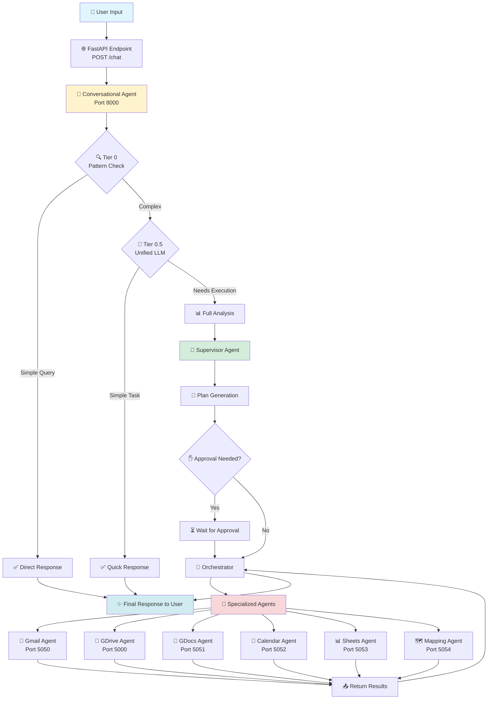
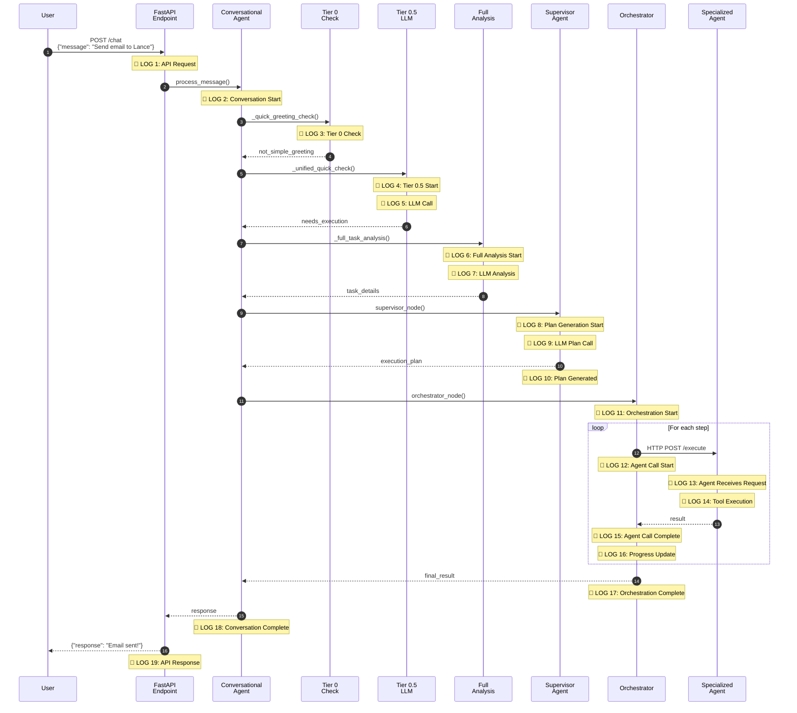
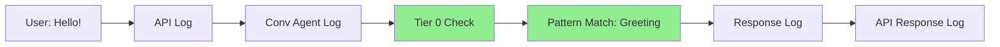
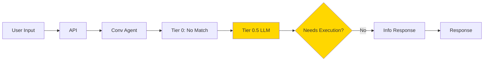
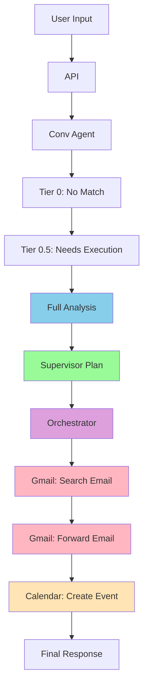
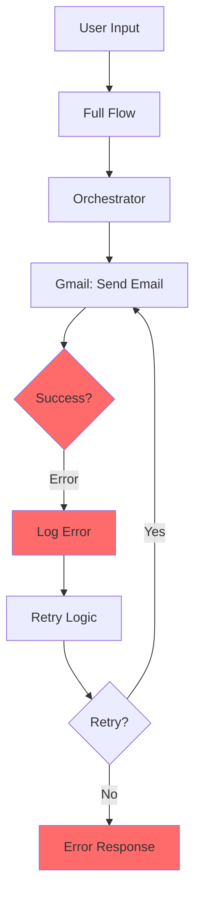

# 🔄 Logging Architecture Flow - Visual Guide

> **Complete request-to-response flow with detailed logging at each step**

---

## 📋 Table of Contents
- [High-Level Architecture](#high-level-architecture)
- [Detailed Flow with Logs](#detailed-flow-with-logs)
- [Step-by-Step Breakdown](#step-by-step-breakdown)
- [Log Field Reference](#log-field-reference)
- [Example Scenarios](#example-scenarios)

---

## 🏗️ High-Level Architecture



---

## 🔍 Detailed Flow with Logs

### **Flow Diagram with Logging Points**



---

## 📊 Step-by-Step Breakdown

### **Step 1: User Request Arrives at API**

**🎯 What Happens:**
- User sends POST request to `/chat` endpoint
- FastAPI receives request and generates request_id
- Request logged with full payload

**📝 Log Entry:**
```json
{
  "timestamp": "2025-11-28T10:30:00.123Z",
  "level": "INFO",
  "component": "api",
  "module": "main",
  "function": "chat_endpoint",
  "request_id": "req_7x9k2m4n",
  "conversation_id": null,
  "thread_id": null,
  "context": {
    "message": "API request received",
    "endpoint": "/chat",
    "method": "POST",
    "user_input": "Send an email to Lance about the project update"
  },
  "progress": {
    "status": "started",
    "percentage": 0,
    "current_step": "Processing user request"
  },
  "performance": {
    "start_time": "2025-11-28T10:30:00.123Z"
  },
  "error": null,
  "metadata": {
    "ip_address": "192.168.1.100",
    "user_agent": "Mozilla/5.0...",
    "content_length": 156
  }
}
```

**📤 Returns:** Request ID to track the conversation

---

### **Step 2: Conversational Agent Initializes**

**🎯 What Happens:**
- Load or create conversation thread
- Initialize conversation memory
- Prepare for tier-based processing

**📝 Log Entry:**
```json
{
  "timestamp": "2025-11-28T10:30:00.234Z",
  "level": "INFO",
  "component": "conversational_agent",
  "module": "conversational_agent",
  "function": "process_message",
  "request_id": "req_7x9k2m4n",
  "conversation_id": "conv_abc123xyz",
  "thread_id": "thread_def456",
  "context": {
    "message": "Conversation initialized",
    "new_thread": false,
    "history_loaded": true,
    "memory_summary": "Previous conversation about project planning"
  },
  "progress": {
    "status": "in_progress",
    "percentage": 5,
    "current_step": "Loading conversation context"
  },
  "performance": {
    "execution_time_ms": 111
  },
  "error": null,
  "metadata": {
    "thread_message_count": 12,
    "memory_tokens": 450
  }
}
```

**📤 Returns:** Conversation context and memory loaded

---

### **Step 3: Tier 0 - Pattern Matching Check**

**🎯 What Happens:**
- Check for simple greetings or clarifications
- Use regex patterns (no LLM calls)
- Fast path for simple queries

**📝 Log Entry:**
```json
{
  "timestamp": "2025-11-28T10:30:00.245Z",
  "level": "DEBUG",
  "component": "conversational_agent",
  "module": "conversational_agent",
  "function": "_quick_greeting_check",
  "request_id": "req_7x9k2m4n",
  "conversation_id": "conv_abc123xyz",
  "thread_id": "thread_def456",
  "context": {
    "message": "Tier 0 pattern check",
    "user_input_lower": "send an email to lance about the project update",
    "patterns_checked": ["greeting", "thanks", "yes/no", "clarification"],
    "match_found": false
  },
  "progress": {
    "status": "in_progress",
    "percentage": 10,
    "current_step": "Tier 0: Pattern matching"
  },
  "performance": {
    "execution_time_ms": 11
  },
  "error": null,
  "metadata": {
    "tier": 0,
    "llm_used": false,
    "cost": 0.0
  }
}
```

**📤 Returns:** `not_simple_greeting` - move to Tier 0.5

---

### **Step 4: Tier 0.5 - Unified LLM Quick Check**

**🎯 What Happens:**
- Use LLM with unified prompt to classify request
- Determine if task needs execution or just info
- Extract quick entities if possible

**📝 Log Entry (Start):**
```json
{
  "timestamp": "2025-11-28T10:30:00.256Z",
  "level": "INFO",
  "component": "conversational_agent",
  "module": "conversational_agent",
  "function": "_unified_quick_check",
  "request_id": "req_7x9k2m4n",
  "conversation_id": "conv_abc123xyz",
  "thread_id": "thread_def456",
  "context": {
    "message": "Tier 0.5 unified check started",
    "prompt_type": "unified_classification",
    "model": "gpt-4o-mini"
  },
  "progress": {
    "status": "in_progress",
    "percentage": 15,
    "current_step": "Tier 0.5: Quick LLM classification"
  },
  "performance": {
    "start_time": "2025-11-28T10:30:00.256Z"
  },
  "error": null,
  "metadata": {
    "tier": 0.5,
    "llm_used": true,
    "model": "gpt-4o-mini"
  }
}
```

**📝 Log Entry (LLM Call):**
```json
{
  "timestamp": "2025-11-28T10:30:00.789Z",
  "level": "DEBUG",
  "component": "conversational_agent",
  "module": "conversational_agent",
  "function": "_unified_quick_check",
  "request_id": "req_7x9k2m4n",
  "conversation_id": "conv_abc123xyz",
  "thread_id": "thread_def456",
  "context": {
    "message": "LLM call completed",
    "classification": "needs_execution",
    "identified_agents": ["gmail"],
    "extracted_entities": {
      "recipient": "Lance",
      "subject": "project update"
    }
  },
  "progress": {
    "status": "in_progress",
    "percentage": 20,
    "current_step": "Tier 0.5: Classification complete"
  },
  "performance": {
    "execution_time_ms": 533,
    "llm_tokens": {
      "prompt": 245,
      "completion": 78,
      "total": 323
    }
  },
  "error": null,
  "metadata": {
    "tier": 0.5,
    "classification_result": "needs_execution",
    "cost": 0.000323
  }
}
```

**📤 Returns:** `needs_execution` - proceed to Full Analysis

---

### **Step 5: Full Analysis Phase**

**🎯 What Happens:**
- Detailed LLM analysis of the task
- Extract all entities, requirements, constraints
- Prepare for supervisor planning

**📝 Log Entry:**
```json
{
  "timestamp": "2025-11-28T10:30:01.234Z",
  "level": "INFO",
  "component": "conversational_agent",
  "module": "conversational_agent",
  "function": "_full_task_analysis",
  "request_id": "req_7x9k2m4n",
  "conversation_id": "conv_abc123xyz",
  "thread_id": "thread_def456",
  "context": {
    "message": "Full task analysis completed",
    "analysis_result": {
      "task_type": "email_composition",
      "complexity": "medium",
      "agents_needed": ["gmail"],
      "entities": {
        "recipient": "lance@example.com",
        "subject": "Project Update - November 2025",
        "tone": "professional"
      },
      "requires_approval": false
    }
  },
  "progress": {
    "status": "in_progress",
    "percentage": 30,
    "current_step": "Full analysis complete, moving to supervisor"
  },
  "performance": {
    "execution_time_ms": 445,
    "llm_tokens": {
      "prompt": 567,
      "completion": 234,
      "total": 801
    }
  },
  "error": null,
  "metadata": {
    "analysis_depth": "full",
    "cost": 0.000801
  }
}
```

**📤 Returns:** Full task details for supervisor

---

### **Step 6: Supervisor - Plan Generation**

**🎯 What Happens:**
- Supervisor agent creates execution plan
- Define steps, agent calls, variable substitutions
- Determine if approval needed

**📝 Log Entry (Start):**
```json
{
  "timestamp": "2025-11-28T10:30:01.456Z",
  "level": "INFO",
  "component": "supervisor",
  "module": "supervisor_agent",
  "function": "supervisor_node",
  "request_id": "req_7x9k2m4n",
  "conversation_id": "conv_abc123xyz",
  "thread_id": "thread_def456",
  "context": {
    "message": "Supervisor plan generation started",
    "task_type": "email_send",
    "available_agents": ["gmail", "gdrive", "gdocs", "calendar", "sheets", "mapping"]
  },
  "progress": {
    "status": "in_progress",
    "percentage": 35,
    "current_step": "Generating execution plan"
  },
  "performance": {
    "start_time": "2025-11-28T10:30:01.456Z"
  },
  "error": null,
  "metadata": {
    "node_type": "supervisor",
    "planning_mode": "standard"
  }
}
```

**📝 Log Entry (LLM Plan Generation):**
```json
{
  "timestamp": "2025-11-28T10:30:02.123Z",
  "level": "INFO",
  "component": "supervisor",
  "module": "supervisor_agent",
  "function": "supervisor_node",
  "request_id": "req_7x9k2m4n",
  "conversation_id": "conv_abc123xyz",
  "thread_id": "thread_def456",
  "context": {
    "message": "Execution plan generated",
    "plan_summary": "3-step plan: compose email, send via Gmail API, confirm delivery",
    "total_steps": 3,
    "agents_involved": ["gmail"],
    "estimated_duration": "5-10 seconds"
  },
  "progress": {
    "status": "in_progress",
    "percentage": 45,
    "current_step": "Plan generated, preparing for execution"
  },
  "performance": {
    "execution_time_ms": 667,
    "llm_tokens": {
      "prompt": 789,
      "completion": 456,
      "total": 1245
    }
  },
  "error": null,
  "metadata": {
    "plan_id": "plan_xyz789",
    "requires_approval": false,
    "cost": 0.001245
  }
}
```

**📤 Returns:** Execution plan with 3 steps

---

### **Step 7: Orchestrator - Execution Begins**

**🎯 What Happens:**
- Orchestrator receives plan
- Iterate through each step
- Make HTTP calls to specialized agents

**📝 Log Entry:**
```json
{
  "timestamp": "2025-11-28T10:30:02.234Z",
  "level": "INFO",
  "component": "supervisor",
  "module": "supervisor_agent",
  "function": "orchestrator_node",
  "request_id": "req_7x9k2m4n",
  "conversation_id": "conv_abc123xyz",
  "thread_id": "thread_def456",
  "context": {
    "message": "Orchestrator started executing plan",
    "plan_id": "plan_xyz789",
    "total_steps": 3,
    "current_step_index": 0
  },
  "progress": {
    "status": "in_progress",
    "percentage": 50,
    "current_step": "Step 1/3: Composing email content"
  },
  "performance": {
    "start_time": "2025-11-28T10:30:02.234Z"
  },
  "error": null,
  "metadata": {
    "node_type": "orchestrator",
    "execution_mode": "sequential"
  }
}
```

**📤 Returns:** Orchestration in progress

---

### **Step 8: Agent Call - Gmail Send Email (Step 1 Execution)**

**🎯 What Happens:**
- Orchestrator makes HTTP POST to Gmail agent
- Substitute variables in the request
- Send full context to agent

**📝 Log Entry (Orchestrator - Outgoing Call):**
```json
{
  "timestamp": "2025-11-28T10:30:02.345Z",
  "level": "INFO",
  "component": "supervisor",
  "module": "supervisor_agent",
  "function": "orchestrator_node",
  "request_id": "req_7x9k2m4n",
  "conversation_id": "conv_abc123xyz",
  "thread_id": "thread_def456",
  "context": {
    "message": "Calling Gmail agent",
    "agent": "gmail",
    "agent_url": "http://localhost:5050/execute",
    "tool": "send_email",
    "parameters": {
      "to": "lance@example.com",
      "subject": "Project Update - November 2025",
      "body": "Hi Lance,\n\nI wanted to update you on the project progress...",
      "from": "user@example.com"
    }
  },
  "progress": {
    "status": "in_progress",
    "percentage": 60,
    "current_step": "Step 1/3: Sending email via Gmail"
  },
  "performance": {
    "start_time": "2025-11-28T10:30:02.345Z"
  },
  "error": null,
  "metadata": {
    "agent_call_id": "call_gmail_001",
    "retry_count": 0,
    "timeout": 30
  }
}
```

**📤 Returns:** HTTP request sent to Gmail agent

---

### **Step 9: Gmail Agent Receives Request**

**🎯 What Happens:**
- Gmail agent API receives POST to `/execute`
- Parse and validate request
- Route to appropriate tool function

**📝 Log Entry:**
```json
{
  "timestamp": "2025-11-28T10:30:02.356Z",
  "level": "INFO",
  "component": "gmail",
  "module": "api",
  "function": "execute_tool",
  "request_id": "req_7x9k2m4n",
  "conversation_id": "conv_abc123xyz",
  "thread_id": "thread_def456",
  "context": {
    "message": "Gmail agent received execution request",
    "tool_name": "send_email",
    "parameters_received": {
      "to": "lance@example.com",
      "subject": "Project Update - November 2025",
      "body_length": 245,
      "from": "user@example.com"
    }
  },
  "progress": {
    "status": "in_progress",
    "percentage": 65,
    "current_step": "Gmail: Processing send email request"
  },
  "performance": {
    "start_time": "2025-11-28T10:30:02.356Z"
  },
  "error": null,
  "metadata": {
    "agent": "gmail",
    "tool": "send_email",
    "source": "supervisor_orchestrator"
  }
}
```

**📤 Returns:** Request validated and routed

---

### **Step 10: Gmail Tool Execution**

**🎯 What Happens:**
- Execute `send_email()` function from tools.py
- Call Gmail API via service object
- Handle OAuth, compose MIME message, send

**📝 Log Entry (Pre-Execution):**
```json
{
  "timestamp": "2025-11-28T10:30:02.367Z",
  "level": "DEBUG",
  "component": "gmail",
  "module": "tools",
  "function": "send_email",
  "request_id": "req_7x9k2m4n",
  "conversation_id": "conv_abc123xyz",
  "thread_id": "thread_def456",
  "context": {
    "message": "Preparing to send email via Gmail API",
    "recipient": "lance@example.com",
    "subject": "Project Update - November 2025",
    "mime_type": "text/html",
    "has_attachments": false
  },
  "progress": {
    "status": "in_progress",
    "percentage": 70,
    "current_step": "Gmail: Composing MIME message"
  },
  "performance": {
    "start_time": "2025-11-28T10:30:02.367Z"
  },
  "error": null,
  "metadata": {
    "oauth_status": "valid",
    "token_expiry": "2025-11-28T16:30:00Z"
  }
}
```

**📝 Log Entry (Gmail API Call):**
```json
{
  "timestamp": "2025-11-28T10:30:03.123Z",
  "level": "INFO",
  "component": "gmail",
  "module": "tools",
  "function": "send_email",
  "request_id": "req_7x9k2m4n",
  "conversation_id": "conv_abc123xyz",
  "thread_id": "thread_def456",
  "context": {
    "message": "Email sent successfully via Gmail API",
    "message_id": "18c5a1b2f3d4e5f6",
    "thread_id": "18c5a1b2f3d4e5f6",
    "label_ids": ["SENT"],
    "recipient": "lan***@example.com"
  },
  "progress": {
    "status": "in_progress",
    "percentage": 85,
    "current_step": "Gmail: Email sent successfully"
  },
  "performance": {
    "execution_time_ms": 756,
    "api_call_time_ms": 623
  },
  "error": null,
  "metadata": {
    "gmail_message_id": "18c5a1b2f3d4e5f6",
    "size_bytes": 1456,
    "api_quota_used": 1
  }
}
```

**📤 Returns:** Success result with message ID

---

### **Step 11: Agent Returns Result to Orchestrator**

**🎯 What Happens:**
- Gmail agent sends HTTP response back
- Include success status and result data
- Return to orchestrator for next step

**📝 Log Entry (Gmail Agent Response):**
```json
{
  "timestamp": "2025-11-28T10:30:03.234Z",
  "level": "INFO",
  "component": "gmail",
  "module": "api",
  "function": "execute_tool",
  "request_id": "req_7x9k2m4n",
  "conversation_id": "conv_abc123xyz",
  "thread_id": "thread_def456",
  "context": {
    "message": "Returning result to orchestrator",
    "status": "success",
    "result_summary": "Email sent to lance@example.com",
    "message_id": "18c5a1b2f3d4e5f6"
  },
  "progress": {
    "status": "in_progress",
    "percentage": 90,
    "current_step": "Gmail: Returning result"
  },
  "performance": {
    "total_execution_time_ms": 878
  },
  "error": null,
  "metadata": {
    "response_size_bytes": 234,
    "http_status": 200
  }
}
```

**📤 Returns:** HTTP 200 with result JSON

---

### **Step 12: Orchestrator Receives Result & Updates Progress**

**🎯 What Happens:**
- Orchestrator receives successful response
- Store result in shared state
- Update progress for user
- Move to next step (or complete if done)

**📝 Log Entry:**
```json
{
  "timestamp": "2025-11-28T10:30:03.245Z",
  "level": "INFO",
  "component": "supervisor",
  "module": "supervisor_agent",
  "function": "orchestrator_node",
  "request_id": "req_7x9k2m4n",
  "conversation_id": "conv_abc123xyz",
  "thread_id": "thread_def456",
  "context": {
    "message": "Step completed successfully",
    "step_index": 0,
    "total_steps": 3,
    "agent": "gmail",
    "tool": "send_email",
    "result_received": true
  },
  "progress": {
    "status": "in_progress",
    "percentage": 95,
    "current_step": "Step 1/3 complete: Email sent to Lance"
  },
  "performance": {
    "step_execution_time_ms": 900
  },
  "error": null,
  "metadata": {
    "steps_completed": 1,
    "steps_remaining": 2,
    "shared_state_updated": true
  }
}
```

**📝 Log Entry (Progress Update):**
```json
{
  "timestamp": "2025-11-28T10:30:03.256Z",
  "level": "PROGRESS",
  "component": "supervisor",
  "module": "supervisor_agent",
  "function": "orchestrator_node",
  "request_id": "req_7x9k2m4n",
  "conversation_id": "conv_abc123xyz",
  "thread_id": "thread_def456",
  "context": {
    "message": "Progress update sent to user",
    "update_type": "step_completion"
  },
  "progress": {
    "status": "in_progress",
    "percentage": 95,
    "current_step": "Email sent to Lance (lance@example.com)",
    "estimated_time_remaining": "2s"
  },
  "performance": null,
  "error": null,
  "metadata": {
    "user_visible": true,
    "update_channel": "websocket"
  }
}
```

**📤 Returns:** Continue to next step or finalize

---

### **Step 13: Orchestrator Completes All Steps**

**🎯 What Happens:**
- All plan steps executed successfully
- Compile final response
- Return to conversational agent

**📝 Log Entry:**
```json
{
  "timestamp": "2025-11-28T10:30:03.456Z",
  "level": "INFO",
  "component": "supervisor",
  "module": "supervisor_agent",
  "function": "orchestrator_node",
  "request_id": "req_7x9k2m4n",
  "conversation_id": "conv_abc123xyz",
  "thread_id": "thread_def456",
  "context": {
    "message": "Orchestration completed successfully",
    "plan_id": "plan_xyz789",
    "steps_executed": 3,
    "steps_successful": 3,
    "steps_failed": 0,
    "final_result": "Email sent successfully to lance@example.com with message ID: 18c5a1b2f3d4e5f6"
  },
  "progress": {
    "status": "completed",
    "percentage": 100,
    "current_step": "Task completed successfully"
  },
  "performance": {
    "total_execution_time_ms": 1222,
    "average_step_time_ms": 407
  },
  "error": null,
  "metadata": {
    "agents_called": ["gmail"],
    "total_agent_calls": 3,
    "retry_attempts": 0
  }
}
```

**📤 Returns:** Final result to conversational agent

---

### **Step 14: Conversational Agent Finalizes Response**

**🎯 What Happens:**
- Format response for user
- Save to conversation memory
- Update thread in database

**📝 Log Entry:**
```json
{
  "timestamp": "2025-11-28T10:30:03.567Z",
  "level": "INFO",
  "component": "conversational_agent",
  "module": "conversational_agent",
  "function": "process_message",
  "request_id": "req_7x9k2m4n",
  "conversation_id": "conv_abc123xyz",
  "thread_id": "thread_def456",
  "context": {
    "message": "Conversation completed successfully",
    "response_type": "task_completion",
    "response_length": 87,
    "memory_saved": true,
    "thread_updated": true
  },
  "progress": {
    "status": "completed",
    "percentage": 100,
    "current_step": "Response ready"
  },
  "performance": {
    "total_conversation_time_ms": 3444,
    "memory_save_time_ms": 45,
    "db_update_time_ms": 66
  },
  "error": null,
  "metadata": {
    "thread_message_count": 13,
    "memory_tokens": 523,
    "summary_updated": true
  }
}
```

**📤 Returns:** Formatted response to API

---

### **Step 15: API Returns Response to User**

**🎯 What Happens:**
- FastAPI endpoint formats final HTTP response
- Include response, metadata, timing
- Send to user

**📝 Log Entry:**
```json
{
  "timestamp": "2025-11-28T10:30:03.678Z",
  "level": "INFO",
  "component": "api",
  "module": "main",
  "function": "chat_endpoint",
  "request_id": "req_7x9k2m4n",
  "conversation_id": "conv_abc123xyz",
  "thread_id": "thread_def456",
  "context": {
    "message": "API response sent successfully",
    "status_code": 200,
    "response_preview": "✅ Email sent successfully to Lance (lance@example.com)"
  },
  "progress": {
    "status": "completed",
    "percentage": 100,
    "current_step": "Request complete"
  },
  "performance": {
    "total_request_time_ms": 3555,
    "breakdown": {
      "tier_0_ms": 11,
      "tier_0.5_ms": 533,
      "full_analysis_ms": 445,
      "supervisor_ms": 667,
      "orchestration_ms": 1222,
      "finalization_ms": 111,
      "total_llm_time_ms": 1645,
      "total_agent_time_ms": 900
    }
  },
  "error": null,
  "metadata": {
    "total_cost": 0.002369,
    "llm_calls": 4,
    "agent_calls": 3,
    "http_status": 200
  }
}
```

**📤 Returns:** JSON response to user's client

```json
{
  "response": "✅ Email sent successfully to Lance (lance@example.com) with subject 'Project Update - November 2025'",
  "conversation_id": "conv_abc123xyz",
  "thread_id": "thread_def456",
  "request_id": "req_7x9k2m4n",
  "metadata": {
    "execution_time_ms": 3555,
    "agents_used": ["gmail"],
    "steps_completed": 3
  }
}
```

---

## 📋 Log Field Reference

### **Core Fields (Always Present)**

| Field | Type | Description | Example |
|-------|------|-------------|---------|
| `timestamp` | ISO 8601 | Exact time of log entry | `2025-11-28T10:30:00.123Z` |
| `level` | String | Log severity | `INFO`, `DEBUG`, `PROGRESS`, `ERROR` |
| `component` | String | System component | `gmail`, `supervisor`, `api` |
| `module` | String | Python module name | `supervisor_agent`, `tools` |
| `function` | String | Function name | `send_email`, `orchestrator_node` |
| `request_id` | String | Unique request identifier | `req_7x9k2m4n` |

### **Context Fields (Vary by Log Type)**

| Field | Type | Description | When Present |
|-------|------|-------------|--------------|
| `conversation_id` | String | Conversation session ID | After Tier 0 |
| `thread_id` | String | Database thread ID | After thread load |
| `context.message` | String | Human-readable description | Always |
| `context.tool` | String | Tool being executed | Agent calls |
| `context.parameters` | Object | Tool parameters | Agent calls |
| `context.result` | Any | Execution result | After completion |

### **Progress Fields (User-Facing Updates)**

| Field | Type | Description | Values |
|-------|------|-------------|--------|
| `progress.status` | String | Current status | `started`, `in_progress`, `completed`, `failed` |
| `progress.percentage` | Integer | Completion percentage | 0-100 |
| `progress.current_step` | String | User-friendly step description | `"Step 2/5: Sending email"` |
| `progress.estimated_time_remaining` | String | Estimated completion time | `"5s"`, `"2m"` |

### **Performance Fields (Timing & Metrics)**

| Field | Type | Description | When Present |
|-------|------|-------------|--------------|
| `performance.start_time` | ISO 8601 | Operation start | Function entry |
| `performance.execution_time_ms` | Integer | Duration in milliseconds | Function exit |
| `performance.llm_tokens.prompt` | Integer | LLM input tokens | After LLM call |
| `performance.llm_tokens.completion` | Integer | LLM output tokens | After LLM call |
| `performance.api_call_time_ms` | Integer | External API duration | After API call |

### **Error Fields (When Errors Occur)**

| Field | Type | Description | Example |
|-------|------|-------------|---------|
| `error.error_type` | String | Error category | `HttpError`, `ValidationError` |
| `error.error_message` | String | Error description | `"401: Invalid credentials"` |
| `error.error_code` | String | Specific error code | `"GMAIL_API_401"` |
| `error.stack_trace` | String | Full traceback | Python stack trace |
| `error.recovery_attempted` | Boolean | Retry attempted? | `true`, `false` |

### **Metadata Fields (Additional Context)**

| Field | Type | Description | Example |
|-------|------|-------------|---------|
| `metadata.cost` | Float | Operation cost in USD | `0.001245` |
| `metadata.model` | String | LLM model used | `gpt-4o-mini` |
| `metadata.agent` | String | Agent name | `gmail` |
| `metadata.retry_count` | Integer | Retry attempts | `0`, `1`, `2` |
| `metadata.user_visible` | Boolean | Show to user? | `true`, `false` |

---

## 🎬 Example Scenarios

### **Scenario 1: Simple Greeting (Tier 0 Exit)**

**User Input:** `"Hello!"`



**Logs Generated:** 5 logs
- API request received
- Conversation initialized
- Tier 0 pattern check (match found)
- Response generated
- API response sent

**Total Time:** ~150ms | **Cost:** $0.00 | **LLM Calls:** 0

---

### **Scenario 2: Quick Info Request (Tier 0.5 Exit)**

**User Input:** `"What emails did I send yesterday?"`



**Logs Generated:** 8 logs
- API request
- Conversation init
- Tier 0 check (no match)
- Tier 0.5 start
- LLM call (classification)
- Info response generation
- Conversation complete
- API response

**Total Time:** ~800ms | **Cost:** $0.0005 | **LLM Calls:** 1

---

### **Scenario 3: Multi-Step Execution (Full Flow)**

**User Input:** `"Forward John's email about Q4 results to Sarah and create a calendar event for discussion"`



**Logs Generated:** ~35 logs
- 5 logs: API and conversation setup
- 8 logs: Tier 0, 0.5, Full Analysis
- 6 logs: Supervisor planning
- 16 logs: Orchestrator (3 steps × ~5 logs each)
- Final response logs

**Total Time:** ~6500ms | **Cost:** $0.012 | **LLM Calls:** 5 | **Agent Calls:** 3

**Detailed Log Count per Step:**
1. Gmail search: 5 logs (request, execution, API call, result, return)
2. Gmail forward: 5 logs (request, execution, API call, result, return)
3. Calendar create: 5 logs (request, execution, API call, result, return)
4. Progress updates: 3 logs (one per step)

---

### **Scenario 4: Error Handling & Retry**

**User Input:** `"Send email to invalid@nonexistent-domain-xyz.com"`



**Logs Generated:** ~20 logs (including retry logs)

**Key Error Log:**
```json
{
  "timestamp": "2025-11-28T10:30:05.123Z",
  "level": "ERROR",
  "component": "gmail",
  "module": "tools",
  "function": "send_email",
  "request_id": "req_abc123",
  "error": {
    "error_type": "SMTPError",
    "error_message": "550: Recipient address rejected",
    "error_code": "SMTP_550",
    "stack_trace": "Traceback...",
    "recovery_attempted": true,
    "retry_count": 1
  },
  "progress": {
    "status": "failed",
    "percentage": 85,
    "current_step": "Email sending failed - invalid recipient"
  }
}
```

---

## 🔧 Log Storage & Query Examples

### **File Structure**
```
logs/
├── app_2025-11-28.log          # All logs (JSON lines)
├── error_2025-11-28.log        # Error logs only
├── progress_2025-11-28.log     # Progress logs only
└── archives/
    └── app_2025-11-27.log.gz   # Rotated logs
```

### **Query Examples**

**1. Find all logs for a specific request:**
```bash
grep "req_7x9k2m4n" logs/app_2025-11-28.log | jq
```

**2. Get all error logs for Gmail agent:**
```bash
jq 'select(.level=="ERROR" and .component=="gmail")' logs/app_2025-11-28.log
```

**3. Calculate average execution time for orchestrator:**
```bash
jq -r 'select(.function=="orchestrator_node" and .performance.execution_time_ms) | .performance.execution_time_ms' logs/app_2025-11-28.log | awk '{sum+=$1; count++} END {print sum/count}'
```

**4. Find all requests that took longer than 5 seconds:**
```bash
jq 'select(.performance.total_request_time_ms > 5000)' logs/app_2025-11-28.log
```

**5. Track progress for a specific conversation:**
```bash
jq 'select(.conversation_id=="conv_abc123xyz" and .level=="PROGRESS")' logs/app_2025-11-28.log
```

---

## 📊 Log Volume & Performance

### **Expected Log Counts per Request Type**

| Request Type | Logs | LLM Calls | Agent Calls | Avg Time | Avg Cost |
|--------------|------|-----------|-------------|----------|----------|
| Simple Greeting (T0) | 5 | 0 | 0 | 150ms | $0.00 |
| Quick Info (T0.5) | 8 | 1 | 0 | 800ms | $0.0005 |
| Single Agent Task | 18 | 4 | 1 | 3500ms | $0.004 |
| Multi-Agent (3 steps) | 35 | 5 | 3 | 6500ms | $0.012 |
| Complex (5+ steps) | 50+ | 6+ | 5+ | 12000ms+ | $0.025+ |
| Error + Retry | +5-10 | +0-1 | +1 | +2000ms | +$0.003 |

### **Daily Volume Estimates**

**Assumptions:** 10,000 daily requests, 60% T0/T0.5, 30% single agent, 10% multi-agent

```
Daily Log Entries:
- T0/T0.5:    6,000 requests × 8 logs  = 48,000 logs
- Single:     3,000 requests × 18 logs = 54,000 logs  
- Multi:      1,000 requests × 35 logs = 35,000 logs
────────────────────────────────────────────────────
Total:                                  137,000 logs/day
```

**Storage:**
- Average log size: 800 bytes
- Daily storage: 137,000 × 800 bytes = ~110 MB/day
- Monthly storage: ~3.3 GB/month (uncompressed)
- Monthly storage: ~800 MB/month (compressed)

---

## 🎯 Summary

This visual guide shows:

✅ **Complete architectural flow** from user input to final response  
✅ **Every logging point** with exact log entries and all fields  
✅ **Step-by-step breakdown** of each phase (Tier 0 → 0.5 → Full → Supervisor → Orchestrator → Agents)  
✅ **Real-world scenarios** with timing, costs, and log volumes  
✅ **Query examples** for troubleshooting and analysis  
✅ **Performance metrics** for capacity planning  

Use this document alongside `log_proposal.md` for complete logging implementation.
